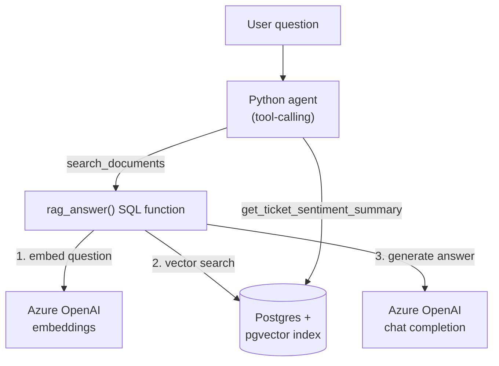

# Azure Database for PostgreSQL — AI & RAG Lab

Building AI-powered applications directly on Azure Database for PostgreSQL: `pgvector` embeddings, semantic search, in-database Azure OpenAI calls via the `azure_ai` extension, a full RAG pipeline as a single SQL function, and a minimal tool-calling agent in Python.

Companion lab for the article [Building AI-Powered Applications with Azure Database for PostgreSQL](https://raphaelgmomoh.pages.dev/articles/azure-postgresql-ai-rag-applications).

---

## 🎯 Architecture



---

## 📚 Repository Structure

```text
.
├── README.md
└── src/
    ├── sql/
    │   ├── 01-extensions.sql       # Enable vector + azure_ai
    │   ├── 02-schema.sql           # documents & support_tickets tables
    │   ├── 03-indexing.sql         # HNSW vector index
    │   ├── 04-semantic-search.sql  # Similarity search query
    │   ├── 05-row-level-security.sql
    │   ├── 06-ai-enrichment.sql    # Sentiment + key-phrase extraction
    │   └── 07-rag-function.sql     # The full RAG pipeline as one function
    └── python/
        ├── agent.py                 # Tool-calling agent (Section 8 of the article)
        └── requirements.txt
```

---

## 🛠️ Quick Start

### 1. Enable the extensions

In the Azure Portal: **Server Parameters → azure.extensions → add `VECTOR,AZURE_AI`**, then:

```bash
psql "host=<server>.postgres.database.azure.com dbname=ragdb user=<user> sslmode=require" -f src/sql/01-extensions.sql
```

### 2. Configure the Azure OpenAI connection

```sql
SELECT azure_ai.set_setting('azure_openai.endpoint', 'https://<your-resource>.openai.azure.com');
SELECT azure_ai.set_setting('azure_openai.subscription_key', '<key>');
```

### 3. Run the schema, indexing, and RAG setup in order

```bash
for f in src/sql/0*.sql; do
  psql "host=<server>.postgres.database.azure.com dbname=ragdb user=<user> sslmode=require" -f "$f"
done
```

### 4. Ask it something

```sql
SELECT rag_answer('How do I reduce my AKS compute bill?');
```

### 5. Run the Python agent

```bash
cd src/python
pip install -r requirements.txt
python agent.py "How do I reduce my AKS compute bill?"
```

---

## License

MIT — use it, fork it, adapt it to your own environment.
